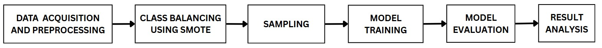
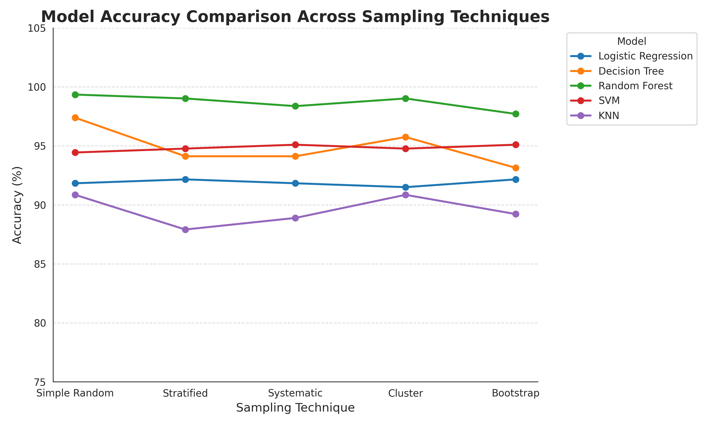

# Assignment-2 Sampling 

## 1. Methodology

## 2. Description

  
The objective of this assignment is to study the impact of various sampling techniques on machine learning model performance. We utilize the Credit Card Fraud dataset, which is originally highly imbalanced. By first balancing the data using SMOTE and then creating samples, we can observe which sampling technique provides the most representative data for training. The results demonstrate that tree-based models like Random Forest perform exceptionally well when trained on representative samples.

## 3. Input / Output
* **Input:** `Creditcard_data.csv` (Features V1-V28, Amount, Class)
* **Output:** Accuracy comparison of models across different sampling techniques.

## 4. Results

|Model|Simple Random|Stratified|Systematic|Cluster|Bootstrap|
|---|---|---|---|---|---|
|Logistic Regression|91\.83|92\.16|91\.83|91\.5|92\.16|
|Decision Tree|97\.39|94\.12|94\.12|95\.75|93\.14|
|Random Forest|99\.35|99\.02|98\.37|99\.02|97\.71|
|SVM|94\.44|94\.77|95\.1|94\.77|95\.1|
|KNN|90\.85|87\.91|88\.89|90\.85|89\.22|

